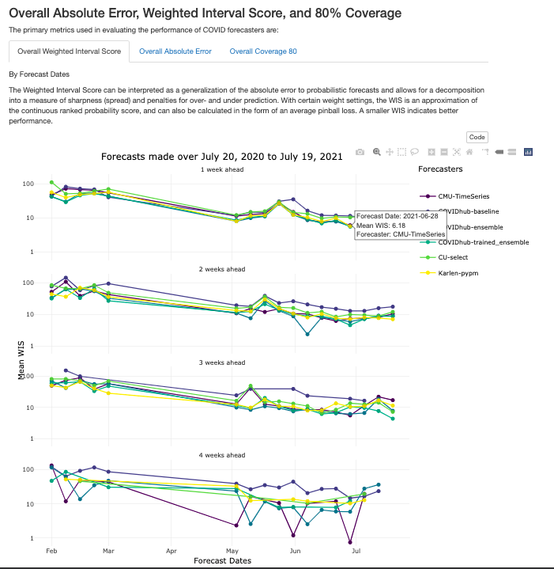

```{r setup, include=FALSE}
knitr::opts_chunk$set(echo = TRUE)
```

**By Stanford Data Science for Social Good (DSSG) Fellows:** Taha Bouhoun, Michelle Lee

**Technical Mentor:** Shilaan Alzahawi

**Faculty Mentors:** Balasubramanian Narasimhan, Daniel McDonald

**Partnering with:** DELPHI Research Group at Carnegie Mellon University

### Summary

The [Delphi Research Group](https://delphi.cmu.edu/about/) at Carnegie Mellon University is one of two influenza forecasters in the United States. In addition to maintaining the largest public repository of real-time indicators of COVID-19 activity, it has also been making forecasts of COVID-19 cases and deaths since March 2020. 

In this project, we designed a customizable, interactive, parameterized report for evaluating and comparing the performance of several COVID-19 forecasters for cases, deaths, and hospitalizations in the United States. Such a report helps provide Delphi insight into the performance of several forecasters over time periods, geographic locations using a choice of metrics. Our approach can be used to generate other informative reports in a production environment.

It is noteworthy that a data exploration template was already created by the Delphi team to explore forecaster performance on Covid-19 deaths. However, this template had limitations, such as the inability to include a wide selection of forecasters, to run in case of API problems, and to download the predictions and raw datasets. Hence, our primary task was to improve the template by adding certain features to better understand forecast performances, including interactive visualization and customizable parameterization: 

* **Forecasters:** A multiple choice option to choose specific forecasters to compare to. 
* **Weeks:** The number of epi-weeks ahead that the forecasts are made (1, 2, 3, or 4). The default is all four choices.
* **Colorblind_palette:** Whether to use a colorblind-safe palette for generating the plots. The default is to use a colorblind-safe palette. 

### Introduction

For this project, the fellows were tasked with creating a template report to evaluate a user’s choice of forecaster against submissions from [COVID-19 Forecast Hub](https://covid19forecasthub.org/). After inputting a set of parameters (forecasters, forecast weeks, color-blind palette), the template yields a comprehensive report on the predictions of COVID forecasters as well as their performance compared to the ground truth.

### About DELPHI Research Group

The DELPHI Research Group is based at Carnegie Mellon University and is one of the two influenza forecasters in the United States. The group’s goal is to develop the theory and practice of epidemiological forecasting, with a long-term vision of making this technology as universally accepted and useful as weather forecasting is today. Prior to COVID-19, the group also worked on forecasting for influenza, dengue, and norovirus. More information on the research group can be found on its [website](https://delphi.cmu.edu/).

### About DELPHI Covidcast 

Since March 2020, the DELPHI research group has maintained the largest public repository of real-time indicators of COVID-19 activity, publicly available through an API. Every Sunday, the DELPHI Covidcast generates forecasts of cumulative COVID-19 cases and deaths in the U.S. Every Monday, a team reviews these predictions, after which they are submitted to [COVID-19 ForecastHub](https://covid19forecasthub.org/). The forecast hub maintains up-to-date records for forecasts of COVID-19 cases, deaths and hospitalizations in the US, created by dozens of leading infectious disease modeling teams from around the globe, in coordination with the US CDC.

### Evaluation Report

The predictions are used to create forecasts by the CDC, as shown in Figure 1.


By creating a forecast evaluation report that includes customizable and interactive plots, DELPHI will know:
How does our (CMU-timeseries) forecaster do compared to others?
Are there periods of time that predict much worse or better? 
Are there areas of improvement we need to focus on?

Also, the report can help assess new forecasters before they are deployed. By evaluating forecasters, epidemiological researchers can gain insights into the performance of their forecasts that will lead to more accurate forecasting of epidemics in the future. It can also accelerate the recovery of lives and communities that have been impacted by COVID-19 while investing in developing the science to mitigate the damage of future pandemics. 

### About Data & The Outcome of Interest 

##### Terms
* **Forecaster:** A named model that produces forecasts, e.g., “COVIDhub-ensemble”

* **Epidemiological week (MMWR week):** A standardized week that starts on a Sunday. See the [CDC definition](https://wwwn.cdc.gov/nndss/document/MMWR_week_overview.pdf) for additional details.

* **Weeks Ahead:** The duration of time between when a prediction was made and the end of the corresponding epidemiological week. Following the [Reich Lab definition](https://github.com/reichlab/covid19-forecast-hub/blob/master/data-processed/README.md#target), a forecast has a horizon of 1 week if it was produced no later than the Monday of the epidemiological week it forecasts. Thus, forecasts made 5-11 days before the end of the corresponding epidemiological week have a horizon of 1 week, 12-18 days before have a horizon of 2 weeks, etc.

These terms are defined by DELPHI covidcast, and more definitions can be found on its [website](https://delphi.cmu.edu/forecast-eval/). 

We examined three main outcomes of interest for the evaluation report.

**Covid-19 cases** data shows the number of COVID-19 confirmed cases newly reported each day. It reflects only cases reported by state and local health authorities. It is based on case counts compiled and made public by a team at Johns Hopkins University (for Puerto Rico) and by USAFacts (all other locations). Note that the signal may not be directly comparable across regions with vastly different testing capacity or reporting criteria. 

Similarly, the data for **Covid-19 deaths** shows the number of COVID-19 related deaths newly reported each day. It reflects official figures reported by state and local health authorities, and may not include excess deaths not confirmed by health authorities to be due to COVID-19. The signal is based on death counts compiled and made public by a team at Johns Hopkins University (for Puerto Rico) and by USAFacts (all other locations). Some signals are based on population, for example, as ‘cumulative number of confirmed COVID-19 cases per 100,000 population’.

The data source for **Covid-19 hospitalization** is different from that of cases and deaths. DELPHI receives from their health system partners aggregated statistics on COVID-related hospital admissions, derived from ICD codes found in insurance claims. Using this data, covidcast estimates the percentage of new hospital admissions each day that are related to COVID-19. Note that these estimates are based only on admissions by patients whose data is accessible to our partners, and address new hospital admissions each day, not all currently hospitalized patients who have COVID-related diagnoses. 

More information on data sources and other indicators can be found on covidcast [website](https://delphi.cmu.edu/covidcast/indicator/?sensor=hospital-admissions-smoothed_adj_covid19_from_claims&date=20210728)

### Evaluation metrics

* **Absolute error** is the difference between the measured value and “true” value. The absolute error of a forecast is the absolute value of the difference between the actual value and the point forecast. The point forecast of a model when not provided explicitly is taken to be the 50% quantile of the forecast distribution.

* **Weighted Interval Score (WIS)** as described in [this article](https://arxiv.org/abs/2005.12881) “can be interpreted as a generalization of the absolute error to probabilistic forecasts and allows for a decomposition into a measure of sharpness [spread and penalties for over- and under-prediction.” With certain weight settings, the WIS is an approximation of the continuous ranked probability score, and can also be calculated in the form of an average pinball loss. A smaller WIS indicates better performance.

* **Coverage 80** is estimated on a particular date by computing the proportion of locations for which a forecaster's interval includes the actual value on that date. A perfectly calibrated forecaster would have each interval's empirical coverage matching its nominal coverage. In the plot, this corresponds to being on the horizontal black line. Overconfidence corresponds to being below the line while underconfidence corresponds to being above the line.

## Our Contribution 

### Project Architecture

The workflow of our project allows users to pick any set of parameters of interest then use the unified template to generate an RMarkdown report, as shown in Figure 2. These choices would be highlighted in the knitted report description and will be accompanied by plots and graphs about the forecaster's performance across time (number of weeks ahead to forecast) and space (U.S. states).


### Retrieving forecast data from AWS

Every Monday, the Delphi Covidcast generates forecasts of cumulative COVID-19 cases and deaths in the U.S. These predictions are reviewed by the team and sent to the CDC COVID-19 Forecast Hub. The generated forecasts and scores are available as RDS files and are uploaded weekly to a publicly accessible AWS bucket, which includes the estimates of a handful of signals (e.g., COVID death, cases, hospitalization, etc). Furthermore, the AWS server stores an array of evaluation metrics of these forecasts (e.g., Absolute Error, Weighted Interval Score). 

The original report relied on covidcast and covideval APIs, which created limitations, such as, slow knitting process in R markdown and the inability to run in case of API issues. Hence, as an alternative, the report can now download the data directly from the AWS bucket, instead of relying on the API system. This transition allowed the template report to run and knit faster, even in cases when dozens of forecasts were chosen. 

### Downloading the data

To prompt the flexibility to replicate the report, the data used in this report can be easily downloaded as a CSV file (Figure 3). By doing so, the user can generate customized plots or even include their own forecaster. 


### Parameters and Helper Functions 

Parameterized reports allow users to choose one or more parameters to customize the analysis, which users can reproduce the analysis at the click of a button. We started by specifying the parameters using the “params” field within the YAML section. Setting paramters inputs (forecasters, weeks, and colorblind palette) shortened the coding lines in the report.  The helper function was added to pull all available forecasters from the Covid-19 Forecast Hub. We now rely on parameters and helper functions to easily change the markdown parameters, as shown in Figure 4 below.


### Interactive Graphs in Tabs

We added better interactivity to plots and they are organized by tabs for easier navigation, as shown in Figure 5.



### Geographical maps
 
To contextualize the forecast evaluations, the following tabs illustrate the performance of COVID-19 forecasts across all US states over forecast dates and weeks ahead, as shown in Figure 6. Note that the results are scaled by population.


### Trajectory plots

The following plots show the predictions of the CMU-TimeSeries forecaster along with the confidence interval for each of the US states. The forecasts project 1, 2, 3, 4 weeks ahead.


### Color-blind palette 


### Potential Future Directions for DELPHI

During the project, the fellows created templated markdown files for each outcome of interest, auxiliary R scripts for manipulating markdowns and generating reports, and example reports that were uploaded to a GitHub repository with fully documented code and vignettes. 

If possible, some potential future directions for DELPHI covidcast on the evaluation template is to 
* transition to a  shiny app that generates an interactive report with the click of a button.
* Add a “County-specific” parameter that evaluates forecaster performance in county levels in the United States.
* Docker solution for batch generation of reports. 

### Citations

Bracher, Johannes, et al. “Evaluating epidemic forecasts in an interval format.” 2021, https://arxiv.org/abs/2005.12881.

Centers for Disease Control and Prevention. “COVID-19 Forecasts: Cases.” COVID-19, https://www.cdc.gov/coronavirus/2019-ncov/science/forecasting/forecasts-cases.html.

COVID-19 Forecast Hub. COVID-19 Forecast Hub, https://covid19forecasthub.org/.

DELPHI. “Explore an INDICATOR.” DELPHI Covidcast, https://delphi.cmu.edu/covidcast/indicator/?sensor=hospital-admissions-smoothed_adj_covid19_from_claims&date=20210728.

DELPHI at CMU. “About DELPHI.” About, https://delphi.cmu.edu/about/.


